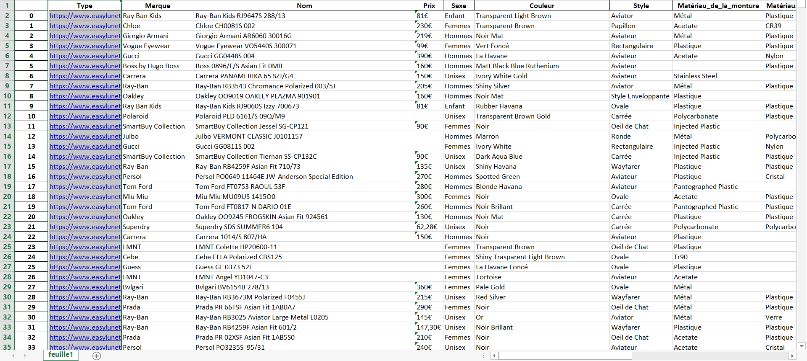
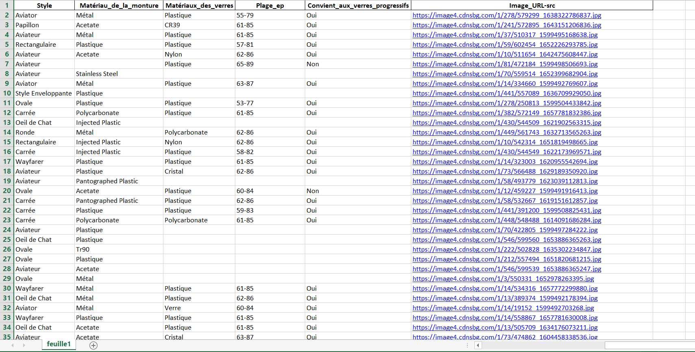
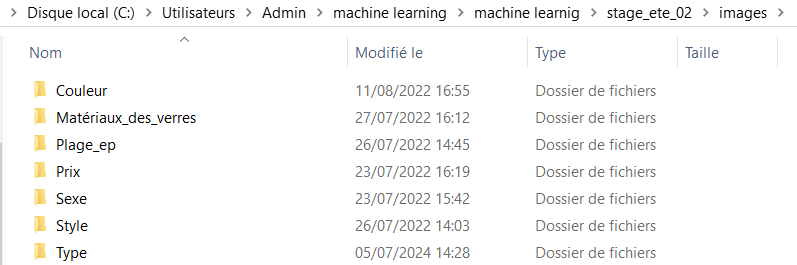
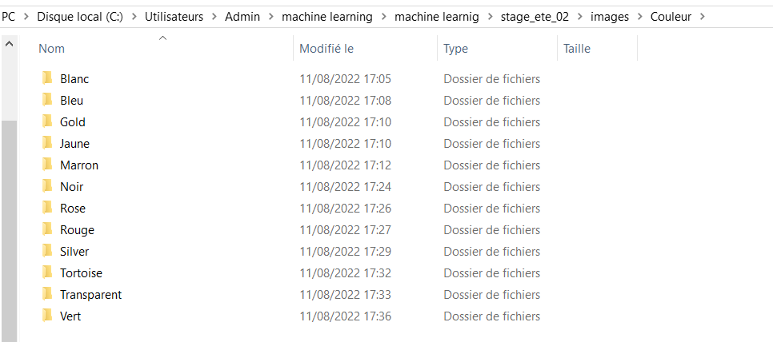
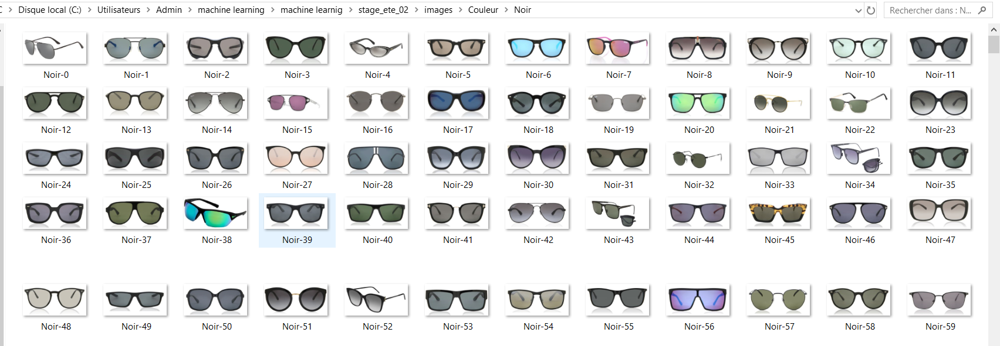
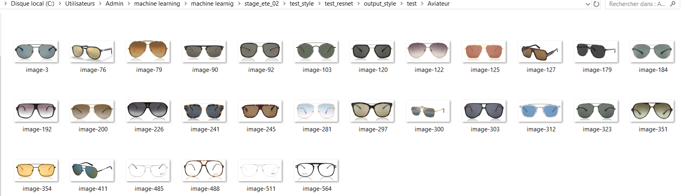
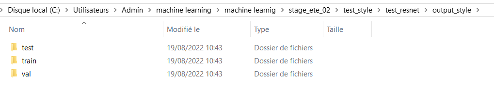
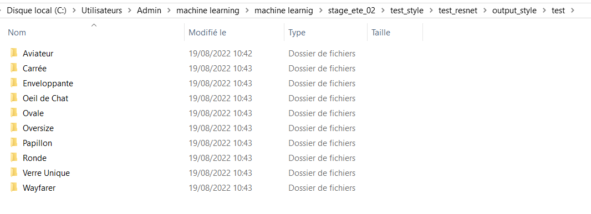
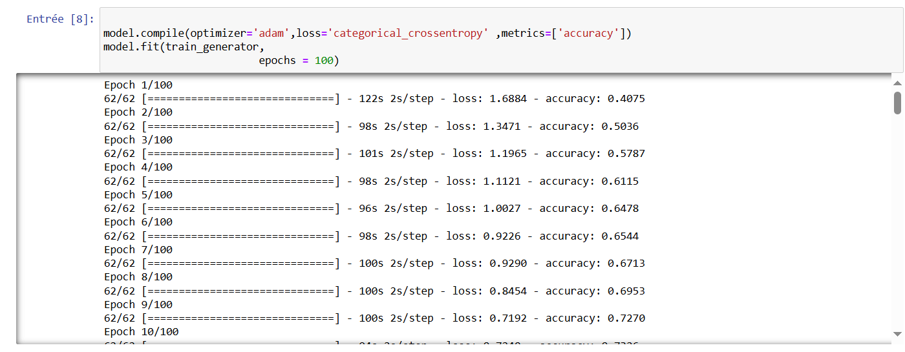

# EasyLunettes Dataset and Glasses Classification

## Table of Contents

- [Introduction](#introduction)
- [Dataset Creation](#dataset-creation)
  - [Web Scraping](#web-scraping)
  - [Data Cleaning](#data-cleaning)
- [Image Dataset Creation](#image-dataset-creation)
  - [Downloading Images](#downloading-images)
  - [Splitting Image Data](#splitting-image-data)
- [Model Training](#model-training)
  - [Model Architecture](#model-architecture)
  - [Training Process](#training-process)
- [Application Development](#application-development)
  - [Flask App for Classification](#flask-app-for-classification)
  - [Application Demonstration](#Application-Demonstration)
- [Dependencies](#dependencies) 


## Introduction

This project involves scraping the "easylunettes" website to create a dataset of glasses, cleaning and preprocessing the data, and using it to train machine learning models for glasses classification. Additionally, a Flask application is developed to classify images of glasses based on their characteristics.

## Dataset Creation

### Web Scraping

The dataset consists of 6528 entries with various attributes such as type (e.g., Optical, Sun), brand, name, price, gender, color, style, frame material, lens materials, and image URLs. Google Web Scraper was utilized for efficient data extraction.



### Data Cleaning

The dataset underwent cleaning procedures to handle missing values, standardize formats, and ensure data quality.

## Image Dataset Creation

### Downloading Images

Images corresponding to each characteristic (e.g., color, lens material) were downloaded using the image URLs from the dataset. The resulting image dataset is structured into folders representing each characteristic, with subfolders for each specific attribute within the characteristic.





### Splitting Image Data

The image dataset was split into training, validation, and test sets using the `splitfolders` library, ensuring a balanced distribution of images across sets.

```python
import splitfolders

import splitfolders
input_folder = "C:\\Users\\Admin\\machine learning\\machine learnig\\stage_ete_02\\test_style\\test_resnet\\input_style"
output = "C:\\Users\\Admin\\machine learning\\machine learnig\\stage_ete_02\\test_style\\test_resnet\\output_style" 
splitfolders.ratio(input_folder, output, seed=42, ratio=(.8, .1, .1))
```





## Model Training

### Model Architecture

ResNet50 was employed as the base architecture for training models on different characteristics such as color, lens material, price, gender, style, and type of glasses.

```python
from tensorflow.keras.layers import Dense, GlobalAveragePooling2D
from tensorflow.keras.applications.resnet50 import preprocess_input, ResNet50
from tensorflow.keras.preprocessing.image import ImageDataGenerator
from tensorflow.keras.models import Model
import matplotlib.pyplot as plt
import numpy as np
import pandas as pd
import seaborn as sns
import tensorflow as tf

img_height, img_width = (224, 224)
batch_size = 32
train_data_dir = r"C:\\Users\\Admin\\machine learning\\machine learnig\\stage_ete_02\\test_style\\test_resnet\\output_style\\train"
valid_data_dir = r"C:\\Users\\Admin\\machine learning\\machine learnig\\stage_ete_02\\test_style\\test_resnet\\output_style\\val"
test_data_dir = r"C:\\Users\\Admin\\machine learning\\machine learnig\\stage_ete_02\\test_style\\test_resnet\\output_style\\test"

train_datagen = ImageDataGenerator(
    preprocessing_function=preprocess_input,
    shear_range=0.2,
    zoom_range=0.2,
    horizontal_flip=True,
    validation_split=0.4
)

train_generator = train_datagen.flow_from_directory(
    train_data_dir,
    target_size=(img_height, img_width),
    batch_size=batch_size,
    class_mode='categorical',
    subset='training'  # set as training data
)

valid_generator = train_datagen.flow_from_directory(
    valid_data_dir,  # same directory as training data
    target_size=(img_height, img_width),
    batch_size=batch_size,
    class_mode='categorical',
    subset='validation'  # set as validation data
)

test_generator = train_datagen.flow_from_directory(
    test_data_dir,  # same directory as training data
    target_size=(img_height, img_width),
    batch_size=1,
    class_mode='categorical',
    subset='validation'  # set as validation data
)

x, y = test_generator.next()
x.shape

base_model = ResNet50(include_top=False, weights='imagenet', input_shape=(img_height, img_width, 3))

for layer in base_model.layers:
    layer.trainable = False

x = base_model.output
x = GlobalAveragePooling2D()(x)
x = Dense(1024, activation='relu')(x)
x = Dense(512, activation='relu')(x)
x = Dense(256, activation='relu')(x)
x = Dense(64, activation='relu')(x)
predictions = Dense(train_generator.num_classes, activation='softmax')(x)
model = Model(inputs=base_model.input, outputs=predictions)

model.summary()

model.compile(optimizer='adam', loss='categorical_crossentropy', metrics=['accuracy'])
model.fit(train_generator, epochs=100)

model.save('C:\\Users\\Admin\\machine learning\\machine learnig\\stage_ete_02\\test_style\\save_test\\ResNet550_style.h5')

test_loss, test_acc = model.evaluate(test_generator, verbose=2)
print('\ntest accuracy:', test_acc)

model = tf.keras.models.load_model("C:\\Users\\Admin\\machine learning\\machine learnig\\stage_ete_02\\test_style\\save_test\\ResNet550_style.h5")
filenames = test_generator.filenames
nb_samples = len(test_generator)
y_prob = []
y_act = []
test_generator.reset()

for _ in range(nb_samples):
    X_test, Y_test = test_generator.next()
    y_prob.append(model.predict(X_test))
    y_act.append(Y_test)

predicted_class = [list(train_generator.class_indices.keys())[i.argmax()] for i in y_prob]
actual_class = [list(train_generator.class_indices.keys())[i.argmax()] for i in y_act]

out_df = pd.DataFrame(np.vstack([predicted_class, actual_class]).T, columns=['predicted_class', 'actual_class'])
confusion_matrix = pd.crosstab(out_df['actual_class'], out_df['predicted_class'], rownames=['Actual'], colnames=['Predicted'])

sns.heatmap(confusion_matrix, cmap='Blues', annot=True, fmt='d')
plt.show()
print('test accuracy: {}'.format((np.diagonal(confusion_matrix).sum() / confusion_matrix.sum().sum() * 100)))
```

## Application Development
### Flask App for Classification
A Flask web application was developed to classify images of glasses using the trained models. Each model predicts characteristics such as style, color, and type based on input images.

```python
from flask import Flask, render_template, request
from keras.models import load_model
from keras.preprocessing import image
from tensorflow.keras.preprocessing.image import load_img

from keras.applications.vgg16 import preprocess_input
from keras.applications.vgg16 import decode_predictions
from keras.applications.vgg16 import VGG16
from numpy import array
import numpy as np

app = Flask(__name__)
model = load_model('models/ResNet50_sexe.h5')
model1 = load_model('models/ResNet50_materiaux_verre.h5')
model2 = load_model('models/ResNet550_style.h5')
model3 = load_model('models/ResNet50type.h5')
model4 = load_model('models/ResNet50_couleur.h5')
model5 = load_model('models/ResNet50_prix.h5')

@app.route('/', methods=['GET'])
def main():
    return render_template("app.html")

@app.route('/', methods=['GET','POST'])
def predict():
    imagefile = request.files['imagefile']
    image_path = "./images/" + imagefile.filename
    imagefile.save(image_path)
    
    img = load_img(image_path, target_size=(224, 224))
    im = np.array(img).reshape(-1, 224, 224, 3)
    prediction = model.predict(im)
    prediction1 = model1.predict(im)
    prediction2 = model2.predict(im)
    prediction3 = model3.predict(im)
    prediction4 = model4.predict(im)
    prediction5 = model5.predict(im)
   
    type_mat = ["Cristal", "Nylon", "Personnalisable", "Plastique", "Polycarbonate"][prediction1.argmax()]
    sexe = ["Sexe_femme", "Sexe_homme"][prediction.argmax()]
    style = ["Aviateur", "Carrée", "Enveloppante", "Oeil de Chat", "Ovale", "Oversize", "Papillon", "Ronde", "Verre Unique", "Wayfarer"][prediction2.argmax()]
    type = ["Opticale", "Soleil"][prediction3.argmax()]
    couleur = ["Blanc", "Bleu", "Gold", "Marron", "Noir", "Rose", "Rouge", "Silver", "Tortoise", "Vert"][prediction4.argmax()]
    prix = ["between 118 and 180", "less than 118", "more than 180"][prediction5.argmax()]
    
    return render_template("app.html", a=sexe, b=type, c=style, d=type_mat, e=couleur, f=prix)

if __name__ == '__main__':
    app.run(port=3010, debug=True)
```
### Application Demonstration

You can watch a demonstration of the application in this [YouTube video](https://www.youtube.com/watch?v=YQXC3owtOF4).


## Dépendances
- TensorFlow
- Flask
- splitfolders
- pandas
- numpy
- matplotlib
- seaborn


